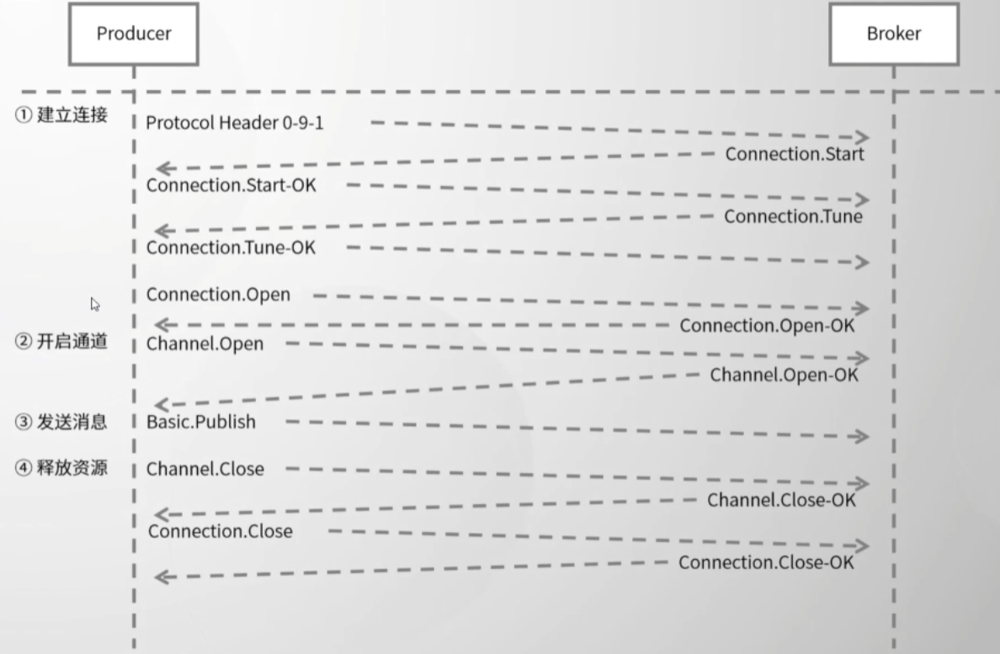
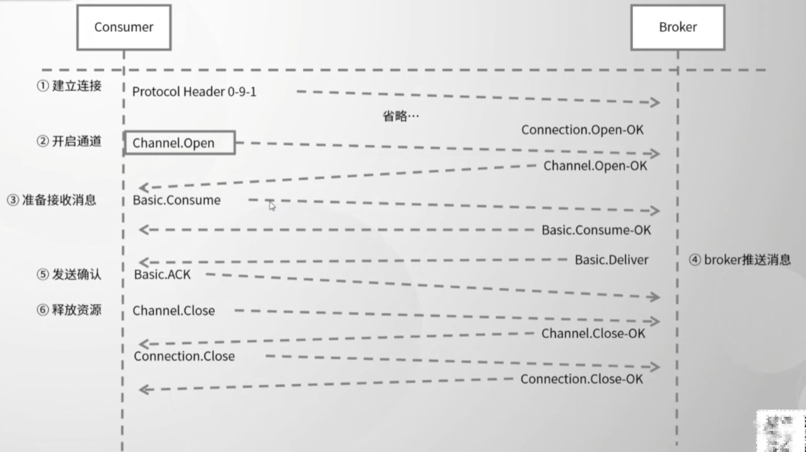
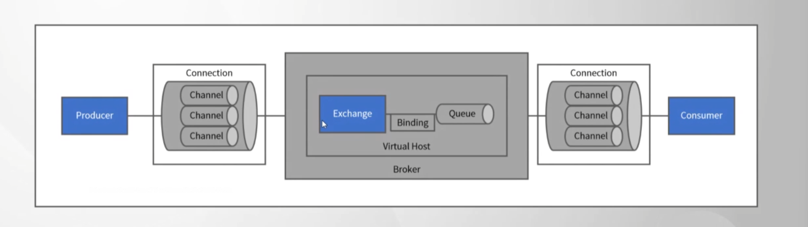
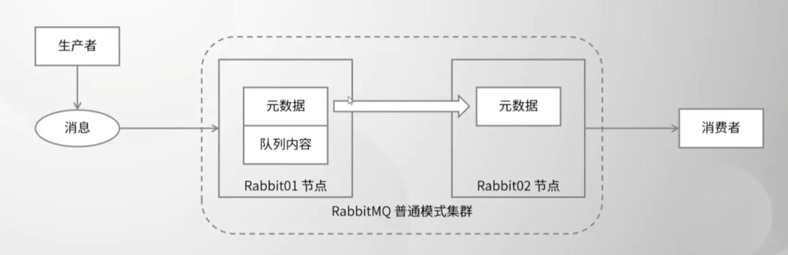
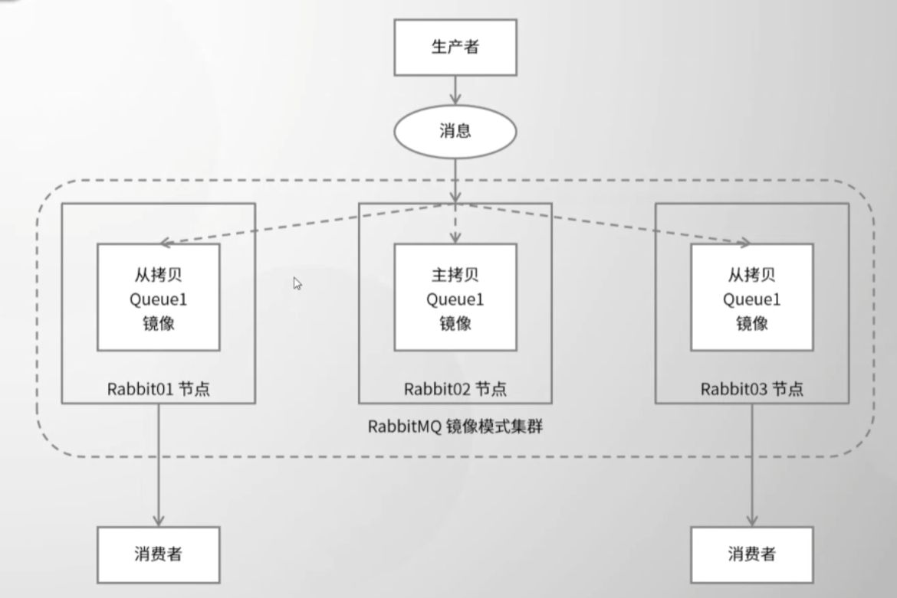

## RabbitMQ

### AMQP
* 定义
> AMQP(Advanced Message Queuing Protocol)高级消息队列协议，是应用层协议的一个开放标准，为面向消息的中间件设计。

* 结构
> 1. Transport Layer：位于最低层，主要传输二进制数据流，提供帧的处理、信道复用、错误检测和数据表示等。
> 2. Session Layer：位于中间层，主要负责将客户端的命令发送给服务器，再将服务端的应答返回给客户端，主要为客户端与服务器之间的通信提供可靠性同步机制和错误处理。
> 3. Module Layer：位于最高层，主要定义了一些供客户端调用的命令，客户端可以利用这些命令实现自己的业务逻辑。

* 生产者流转过程

* 消费者流转过程

### 运转流程

* 生产这发送消息的过程
  * 生产者连接到RabbitMQ Broker，建立一个连接（Connection）,开启一个信道（Channel）
  * 生产者声明一个交换机，并设置相关属性，比如交换机类型、是否持久化等
  * 生产者声明一个队列并设置相关属性，比如是否排他、是否持久化、是否自动删除等
  
* 消费者消费消息的过程
  * 消费者确认（ack）接收到的消息
  * RabbitMQ从队列中删除相应已经被确认的消息
  * 关闭信道、关闭连接

### 高可用方案
* cluster

同步元数据，不同步队列数据，如果存在一个节点挂掉，在该节点的数据就无法访问。
* 镜像

